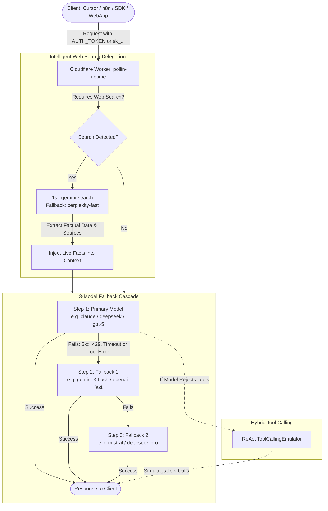

<div align="center">

# ⚡ Pollin Uptime

### High Availability Serverless AI Gateway for Pollinations.ai with 3-Model Fallback Cascade & Search-Augmented Generation
### Gateway Serverless de Alta Disponibilidade para Pollinations.ai com Cascata Tripla de Fallback e Busca Web Inteligente

[](https://deploy.workers.cloudflare.com/?url=https://github.com/samucamg/pollin-uptime)

[](https://www.typescriptlang.org/)
[](https://workers.cloudflare.com/)
[](https://hono.dev/)
[](https://pollinations.ai/)
[](#-openai-compatible-api)
[](#-anthropic-messages-api)
[](LICENSE)

**[🇺🇸 English](#english) · [🇧🇷 Português](#portugues)**

</div>

---

<a id="english"></a>
# 🇺🇸 English

## ✨ Overview

**Pollin Uptime** is an edge-native, enterprise-grade AI gateway designed to provide **99.9% uptime and zero-interruption availability** on top of the [Pollinations.ai](https://pollinations.ai) ecosystem.

Built with **Cloudflare Workers**, **Hono**, and **TypeScript**, it runs across hundreds of Cloudflare edge locations worldwide with near-zero cold starts. It safeguards your upstream credentials, intercepts failures, and transparently routes requests through a **3-model fallback cascade** while enabling **hybrid tool calling** and **Search-Augmented Generation (SAG)**.



---

## 🚀 One-Click Cloudflare Deploy

Deploy your own private, production-ready gateway in less than 60 seconds directly into Cloudflare:

<div align="center">

[](https://deploy.workers.cloudflare.com/?url=https://github.com/samucamg/pollin-uptime)

</div>

### 🧩 Deployment Form Parameters

| Field | Example Value | Description |
|---|---|---|
| **Project name** | `pollin-uptime` | Name for your Worker deployment. |
| **RATE_LIMIT_STORE** | `pollin-rate-limit` | Cloudflare KV namespace for distributed DDoS & abuse prevention. |
| **CACHE_STORE** | `pollin-cache` | Cloudflare KV namespace for dynamic model registry and cache. |
| **`POLLINATIONS_API_KEY`** | `sk_...` | Your Pollinations Secret API Key from [enter.pollinations.ai](https://enter.pollinations.ai/keys). *(Optional in BYOP mode)* |
| **`AUTH_TOKEN`** | *(Your secure password)* | Master private token that clients send to authenticate with your gateway. |
| **`DEFAULT_FALLBACK_1`** | `gemini-3-flash` | First fallback model if primary fails. |
| **`DEFAULT_FALLBACK_2`** | `openai-fast` | Second fallback model. |
| **`DEFAULT_FALLBACK_3`** | `mistral` | Third safety net fallback. |

---

## 🧰 Key Features

1. **🛡️ 3-Model Fallback Cascade:**
   - Automatically retries requests across 3 candidate models upon upstream 429 (rate-limit / queue full), 500/502/503/504 errors, timeouts, or tool execution refusals.
   - Customizable per-request via `x-fallback-models: modelA,modelB` header.
2. **🌐 Search-Augmented Generation (SAG):**
   - Automatically delegates web search sub-tasks to the fastest, most economical search model (`gemini-search` with fallback to `perplexity-fast`).
   - Injects fresh internet facts and sources directly into the context of the **original model chosen by the user** (e.g. `deepseek`, `claude`, `qwen`), preserving its personality and analytical depth!
3. **🛠️ Hybrid Tool Calling:**
   - First attempts native OpenAI `tools`.
   - If the backend model does not support native tools (or returns a 400 parameter rejection), the gateway activates the **ReAct ToolCallingEmulator**, injecting rigid schema instructions and formatting model responses back into standard `tool_calls`.
4. **🔌 Universal Compatibility:**
   - **OpenAI Compatible:** `/v1/chat/completions`, `/v1/models`, `/v1/images/generations`, `/v1/images/edits`, `/v1/audio/transcriptions`, `/v1/audio/speech`.
   - **Anthropic Compatible:** `/v1/messages` translates Anthropic Messages API payloads and SSE streaming.
   - **Direct Shortcuts:** `/image/:prompt`, `/text/:prompt`, `/text`.
5. **📊 Transparency Headers:**
   - `x-gateway-model-used`: exact model that satisfied the request.
   - `x-gateway-attempts`: number of cascade steps executed.
   - `x-gateway-fallback-chain`: sequence of models attempted.
   - `x-gateway-latency-ms`: total processing duration in milliseconds.
   - `x-gateway-tool-mode`: `native` or `emulated`.
   - `x-gateway-search-performed`: `true` if live internet search was injected.

---

## 💻 Usage Examples

### 1. OpenAI SDK (Python)

```python
from openai import OpenAI

client = OpenAI(
    base_url="https://YOUR-WORKER.workers.dev/v1",
    api_key="YOUR_AUTH_TOKEN"  # or your Pollinations sk_... key
)

response = client.chat.completions.create(
    model="claude",
    messages=[
        {"role": "user", "content": "What are the latest updates on space exploration?"}
    ],
    extra_headers={
        "x-fallback-models": "gemini-3-flash,openai-fast",
        "x-web-search": "true"  # Triggers search delegation!
    }
)

print(response.choices[0].message.content)
```

### 2. OpenAI SDK (TypeScript / Node.js)

```typescript
import OpenAI from "openai";

const client = new OpenAI({
  baseURL: "https://YOUR-WORKER.workers.dev/v1",
  apiKey: process.env.GATEWAY_AUTH_TOKEN,
});

const stream = await client.chat.completions.create({
  model: "deepseek",
  messages: [{ role: "user", content: "Write a high-performance LRU cache in Rust." }],
  stream: true,
});

for await (const chunk of stream) {
  process.stdout.write(chunk.choices[0]?.delta?.content || "");
}
```

### 3. Anthropic Messages API Bridge

```bash
curl -X POST "https://YOUR-WORKER.workers.dev/v1/messages" \
  -H "Authorization: Bearer YOUR_AUTH_TOKEN" \
  -H "Content-Type: application/json" \
  -d '{
    "model": "claude",
    "max_tokens": 1024,
    "messages": [
      {"role": "user", "content": "Explain quantum superposition simply."}
    ]
  }'
```

---

<a id="portugues"></a>
# 🇧🇷 Português

## ✨ Visão Geral

O **Pollin Uptime** é um gateway de IA serverless de alta disponibilidade criado para garantir **99.9% de uptime contínuo** sobre o ecossistema [Pollinations.ai](https://pollinations.ai).

Desenvolvido com **Cloudflare Workers**, **Hono** e **TypeScript**, ele roda na borda global (edge) da Cloudflare com inicialização quase instantânea. Ele blinda suas credenciais upstream, intercepta quedas e roteia requisições através de uma **cascata tripla de fallback**, com suporte a **emulação de tools** e **busca web com retorno ao modelo de origem (Search-Augmented Generation)**.

---

## 🚀 Deploy em 1 Clique na Cloudflare

Implante sua própria instância em menos de 1 minuto diretamente na Cloudflare:

<div align="center">

[](https://deploy.workers.cloudflare.com/?url=https://github.com/samucamg/pollin-uptime)

</div>

### 🧩 Formulário de Configuração do Deploy

| Campo | Exemplo Seguro | Descrição |
|---|---|---|
| **Project name** | `pollin-uptime` | Nome da aplicação no Workers e URL padrão `workers.dev`. |
| **RATE_LIMIT_STORE** | `pollin-rate-limit` | Namespace KV para controle de taxa e proteção contra abusos. |
| **CACHE_STORE** | `pollin-cache` | Namespace KV para cache do catálogo dinâmico de modelos. |
| **`POLLINATIONS_API_KEY`** | Sua chave `sk_...` | Chave secreta da Pollinations obtida em [enter.pollinations.ai](https://enter.pollinations.ai/keys). *(Opcional se usar BYOP)* |
| **`AUTH_TOKEN`** | *(Sua senha segura)* | Token mestre privado que seus clientes enviarão para acessar o gateway. |
| **`DEFAULT_FALLBACK_1`** | `gemini-3-flash` | 1º modelo de fallback caso o primário falhe. |
| **`DEFAULT_FALLBACK_2`** | `openai-fast` | 2º modelo de fallback. |
| **`DEFAULT_FALLBACK_3`** | `mistral` | 3º modelo de segurança final. |

---

## 🛠️ Recursos Principais

- **🔄 Cascata Tripla de Fallback:** Chaveamento automático se o modelo primário sofrer erro 429 (fila cheia / rate limit), 5xx, timeout ou rejeição de ferramentas.
- **🌐 Desvio Inteligente de Busca Web (SAG):** A sub-tarefa de pesquisa é desviada para o modelo de busca mais rápido e barato (`gemini-search` com fallback em `perplexity-fast`), e os dados obtidos são injetados no contexto do **modelo de origem escolhido pelo usuário** (`deepseek`, `claude`, etc.).
- **🧩 Emulador de Ferramentas Híbrido:** Se o modelo escolhido não tiver suporte nativo a `tools` na Pollinations, o gateway aciona automaticamente o `ToolCallingEmulator` ReAct, garantindo respostas estruturadas em `tool_calls` em qualquer modelo.
- **🔌 Compatibilidade Dupla:** Padrão OpenAI (`/v1/chat/completions`, `/v1/models`, imagens e áudio) e Anthropic Messages (`/v1/messages`).
- **📊 Headers de Transparência:** Respostas acompanhadas de `x-gateway-model-used`, `x-gateway-attempts`, `x-gateway-fallback-chain` e `x-gateway-latency-ms`.

---

## 📄 Licença

Distribuído sob licença MIT. Veja [LICENSE](LICENSE) para detalhes.
