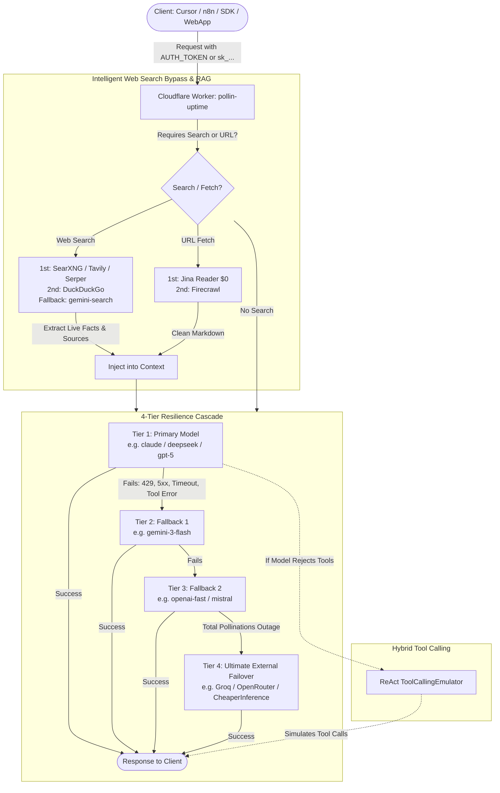

<div align="center">

# ⚡ Pollin Uptime

### High Availability Serverless AI Gateway for Pollinations.ai with 4-Tier Fallback Cascade, Search-Augmented Generation & Free-Tier RAG
### Gateway Serverless de Alta Disponibilidade para Pollinations.ai com Cascata de 4 Níveis, Desvio de Busca Web e RAG com Free Tier Real

[](https://deploy.workers.cloudflare.com/?url=https://github.com/samucamg/pollin-uptime)

[](https://www.typescriptlang.org/)
[](https://workers.cloudflare.com/)
[](https://hono.dev/)
[](https://pollinations.ai/)
[](deploy/searxng/)
[](deploy/searxng/portainer-stack.yml)
[](#-endpoint-matrix)
[](#-endpoint-matrix)
[](LICENSE)

**[🇺🇸 English](#english) · [🇧🇷 Português](#portugues)**

</div>

---

<a id="english"></a>
# 🇺🇸 English

## ✨ Overview

**Pollin Uptime** is an enterprise-grade, edge-native AI gateway that delivers **99.9% availability** on top of [Pollinations.ai](https://pollinations.ai). It shields upstream credentials, prevents downtime via a **4-tier resilience cascade** (Primary Model ➔ Fallback 1 ➔ Fallback 2 ➔ External OpenAI-compatible provider), and features **Search-Augmented Generation (SAG)** with zero-cost real free-tier search engines (SearXNG, Jina Reader, Tavily, Serper, DuckDuckGo).



---

## 🗺️ Endpoint Matrix

| Method | Endpoint | Compatibility | Description |
|---|---|---|---|
| `GET` | `/` | Gateway | Health check and endpoint discovery |
| `GET` | `/v1/models` | OpenAI-style | Dynamic upstream model catalog with KV cache |
| `POST` | `/v1/chat/completions` | OpenAI | Chat, vision input, and SSE streaming with 4-tier cascade |
| `POST` | `/v1/responses` | OpenAI | Structured Responses API and reasoning controls |
| `POST` | `/v1/messages` | Anthropic | Messages API translation and streaming bridge |
| `POST` | `/v1/images/generations` | OpenAI | Image generation with automatic model fallback |
| `POST` | `/v1/images/edits` | OpenAI | Image editing with prompt and reference image |
| `POST` | `/v1/audio/speech` | OpenAI | Multi-engine text-to-speech |
| `POST` | `/v1/audio/transcriptions` | OpenAI | Multipart speech-to-text (Whisper) |
| `POST` | `/v1/audio/translations` | OpenAI | Audio translation to English |
| `POST` | `/v1/search` | Gateway | Dedicated web search hub (SearXNG / Tavily / Serper) |
| `POST` | `/v1/web/fetch` | Gateway | Dedicated Jina Reader ($0) / Firecrawl URL scraper |

---

## 🔍 Web Search & RAG: Real Free-Tier Providers

Why pay for search or enter credit cards? We selected search and fetch providers that have **real free tiers (no credit card required)**:

| Provider | Type | Free Tier | Setup | Credit Card? |
|---|---|---|---|:---:|
| **SearXNG** | Search | **100% Free ($0)**, Unlimited | Self-hosted via included [Docker Compose / Portainer](deploy/searxng/) | ❌ **No** |
| **Jina Reader (`r.jina.ai`)** | Web Fetch | **100% Free ($0)**, Unlimited | No API key needed. Converts any webpage to clean Markdown | ❌ **No** |
| **DuckDuckGo HTML** | Search | **100% Free ($0)**, Unlimited | Native edge scraper, no API key needed | ❌ **No** |
| **Tavily Search** | Search | **1,000 queries/month free** | Get key at [tavily.com](https://tavily.com) | ❌ **No** |
| **Google Serper** | Search | **2,500 free queries** | Get key at [serper.dev](https://serper.dev) | ❌ **No** |
| **Firecrawl** | Web Scrape | **500 free scrape credits** | Get key at [firecrawl.dev](https://firecrawl.dev) | ❌ **No** |
| **Pollinations Search** | Search | **Free via Pollinations** | `gemini-search` & `perplexity-fast` | ❌ **No** |

> 🚫 **Excluded Providers:**
> - **Brave Search API:** Excluded because it requires a mandatory $5 deposit and credit card upfront.
> - **Perplexity API:** Excluded because it is paid per token/credit.
> - **Google Programmable Search:** Excluded because it is complex, rate-limited, and SearXNG completely replaces it with superior privacy.

### Configuring Search Slots (Up to 2 Search & 2 Fetch Providers)

In your Cloudflare Worker environment variables (`vars` in `wrangler.jsonc`) or `.dev.vars` (for secret keys):

```env
# --- Environment Variables (wrangler.jsonc vars - open text) ---
SEARCH_PROVIDER_1_TYPE=duckduckgo
SEARCH_PROVIDER_1_URL=
SEARCH_PROVIDER_2_TYPE=tavily
SEARCH_PROVIDER_2_URL=
FETCH_PROVIDER_1_TYPE=jina
ENABLE_JINA_READER=true
FETCH_PROVIDER_2_TYPE=firecrawl

# --- Secrets & Keys (.dev.vars / Cloudflare Secrets) ---
SEARCH_PROVIDER_1_KEY=
SEARCH_PROVIDER_2_KEY=tvly-your_key_here
FETCH_PROVIDER_2_KEY=fc-your_key_here
```

---

## 🐳 Self-Hosted SearXNG (Docker & Portainer Stack)

Included in [deploy/searxng/](deploy/searxng/):

1. **Docker Compose:** Run `docker compose up -d` in `deploy/searxng/`.
2. **Portainer Web UI:** Copy the contents of `deploy/searxng/portainer-stack.yml` into Portainer ➔ Stacks ➔ Add stack.
3. Configure `SEARCH_PROVIDER_1_URL=http://YOUR_SERVER_IP:8080` in your Worker!

---

<a id="portugues"></a>
# 🇧🇷 Português

## ✨ Visão Geral

O **Pollin Uptime** é um gateway de IA serverless projetado para garantir **99.9% de uptime contínuo** sobre a infraestrutura da [Pollinations.ai](https://pollinations.ai).

Conta com uma **cascata de 4 camadas de resiliência** (Modelo Principal ➔ Fallback 1 ➔ Fallback 2 ➔ Provedor Externo OpenAI-Compatible), emulação ReAct de tools e **desvio inteligente de busca web com Free Tier Real** (SearXNG, Jina Reader, Tavily, Serper, DuckDuckGo).

---

## 🗺️ Matriz de Endpoints

| Método | Endpoint | Compatibilidade | Descrição |
|---|---|---|---|
| `GET` | `/` | Gateway | Health check e descoberta de capacidades |
| `GET` | `/v1/models` | OpenAI-style | Catálogo dinâmico com cache em KV |
| `POST` | `/v1/chat/completions` | OpenAI | Chat, visão e streaming SSE com cascata de 4 níveis |
| `POST` | `/v1/responses` | OpenAI | Responses API com `output[]` e reasoning |
| `POST` | `/v1/messages` | Anthropic | Tradução da Messages API e streaming SSE |
| `POST` | `/v1/images/generations` | OpenAI | Geração de imagens com fallback |
| `POST` | `/v1/images/edits` | OpenAI | Edição de imagens com prompt e referência |
| `POST` | `/v1/audio/speech` | OpenAI | Text-to-speech multi-engine |
| `POST` | `/v1/audio/transcriptions` | OpenAI | Transcrição de áudio (Whisper) |
| `POST` | `/v1/audio/translations` | OpenAI | Tradução de áudio para inglês |
| `POST` | `/v1/search` | Gateway | Endpoint direto de busca web (SearXNG / Tavily / Serper) |
| `POST` | `/v1/web/fetch` | Gateway | Endpoint direto de extração de URL em Markdown (Jina / Firecrawl) |

---

## 🔍 Busca Web & RAG: Provedores com Free Tier Real (Sem Cartão)

| Provedor | Função | Cota Gratuita | Como Configurar | Cartão de Crédito? |
|---|---|---|---|:---:|
| **SearXNG** | Busca Web | **100% Grátis ($0)**, Ilimitado | Self-hosted via [Docker Compose / Portainer](deploy/searxng/) | ❌ **Não** |
| **Jina Reader (`r.jina.ai`)** | Leitura de URL | **100% Grátis ($0)**, Ilimitado | Sem chave. Converte páginas web em Markdown limpo | ❌ **Não** |
| **DuckDuckGo HTML** | Busca Web | **100% Grátis ($0)**, Ilimitado | Scraping direto no edge, sem chave de API | ❌ **Não** |
| **Tavily Search** | Busca Web | **1.000 buscas/mês grátis** | Chave gratuita em [tavily.com](https://tavily.com) | ❌ **Não** |
| **Google Serper** | Busca Web | **2.500 buscas grátis** | Chave gratuita em [serper.dev](https://serper.dev) | ❌ **Não** |
| **Firecrawl** | Web Scrape | **500 créditos grátis** | Chave gratuita em [firecrawl.dev](https://firecrawl.dev) | ❌ **Não** |
| **Pollinations Search** | Busca Web | **Grátis via Pollinations** | Fallback nativo: `gemini-search` e `perplexity-fast` | ❌ **Não** |

> 🚫 **Serviços Excluídos:**
> - **Brave Search API:** Excluído por exigir depósito de $5 e cartão de crédito.
> - **Perplexity API:** Excluído por ser cobrado por token/crédito.
> - **Google Programmable Search:** Excluído por ser obsoleto e o SearXNG fazer a mesma função com mais privacidade e flexibilidade.

---

## 🚀 Deploy em 1 Clique na Cloudflare

<div align="center">

[](https://deploy.workers.cloudflare.com/?url=https://github.com/samucamg/pollin-uptime)

</div>

### 🧩 Variáveis de Configuração e Segredos
Todos os campos são **opcionais** e podem ser deixados em branco caso não vá utilizar o recurso específico.

#### 🔒 Segredos (`.dev.vars` / Cloudflare Secrets) - Apenas Chaves e Senhas
| Segredo | Exemplo | Descrição |
|---|---|---|
| **`POLLINATIONS_API_KEY`** | `sk_...` | Chave secreta da Pollinations ([enter.pollinations.ai](https://enter.pollinations.ai/keys)). Deixe vazio para modo gratuito/público. |
| **`AUTH_TOKEN`** | `sua-senha-mestra` | Token mestre privado para seus clientes acessarem o gateway. Deixe vazio para acesso livre. |
| **`EXTERNAL_FALLBACK_KEY`** | `gsk_...` | Chave de API do provedor externo (Groq, OpenRouter). Deixe vazio se não usar failover externo. |
| **`SEARCH_PROVIDER_1_KEY`** | `tvly-...` | Chave de API de busca (se usar Tavily ou Serper). Deixe vazio para DuckDuckGo ou SearXNG. |
| **`SEARCH_PROVIDER_2_KEY`** | `tvly-...` | Chave de API de busca do 2º provedor. Deixe vazio se não for utilizar. |
| **`FETCH_PROVIDER_2_KEY`** | `fc-...` | Chave de API do Firecrawl. Deixe vazio se utilizar apenas Jina Reader ($0 sem chave). |

#### 🌐 Variáveis de Ambiente (`wrangler.jsonc` `vars` - Texto Aberto)
| Variável | Padrão | Descrição |
|---|---|---|
| **`EXTERNAL_FALLBACK_URL`** | `""` | URL do endpoint compatível com OpenAI (ex: `https://api.groq.com/openai/v1`). |
| **`EXTERNAL_FALLBACK_MODEL`** | `llama-3.3-70b-versatile` | Modelo para o failover externo de emergência. |
| **`SEARCH_PROVIDER_1_TYPE`** | `duckduckgo` | Motor de busca padrão (`duckduckgo`, `searxng`, `tavily`, `serper`). |
| **`SEARCH_PROVIDER_1_URL`** | `""` | URL do seu SearXNG (ex: `http://seu-host:8080`). Vazio para DuckDuckGo. |
| **`SEARCH_PROVIDER_2_TYPE`** | `""` | Segundo motor de busca opcional. |
| **`SEARCH_PROVIDER_2_URL`** | `""` | URL do 2º provedor de busca se for SearXNG. |
| **`FETCH_PROVIDER_1_TYPE`** | `jina` | Motor de leitura de URLs (`jina` $0 gratuito ou `firecrawl`). |
| **`FETCH_PROVIDER_1_URL`** | `""` | URL customizada para o 1º provedor de fetch. |
| **`FETCH_PROVIDER_2_TYPE`** | `""` | Segundo provedor de fetch opcional. |
| **`FETCH_PROVIDER_2_URL`** | `""` | URL customizada para o 2º provedor de fetch. |

---

## 🐳 Suba seu próprio SearXNG (Docker Compose e Portainer)

Na pasta [deploy/searxng/](deploy/searxng/):
1. **Via Docker Compose:** `cd deploy/searxng && docker compose up -d`.
2. **Via Portainer Web:** Copie o arquivo [portainer-stack.yml](deploy/searxng/portainer-stack.yml) e cole na aba Stacks do Portainer.

---

## 📄 Licença

Distribuído sob licença MIT. Veja [LICENSE](LICENSE) para detalhes.
